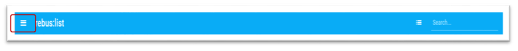
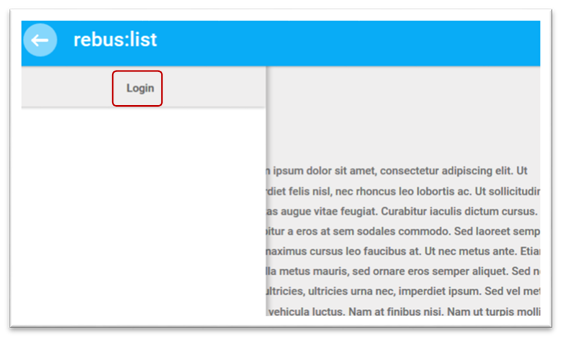
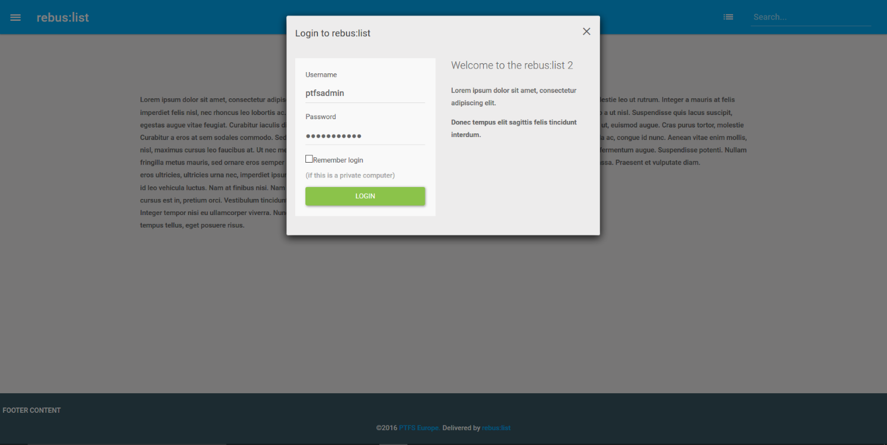
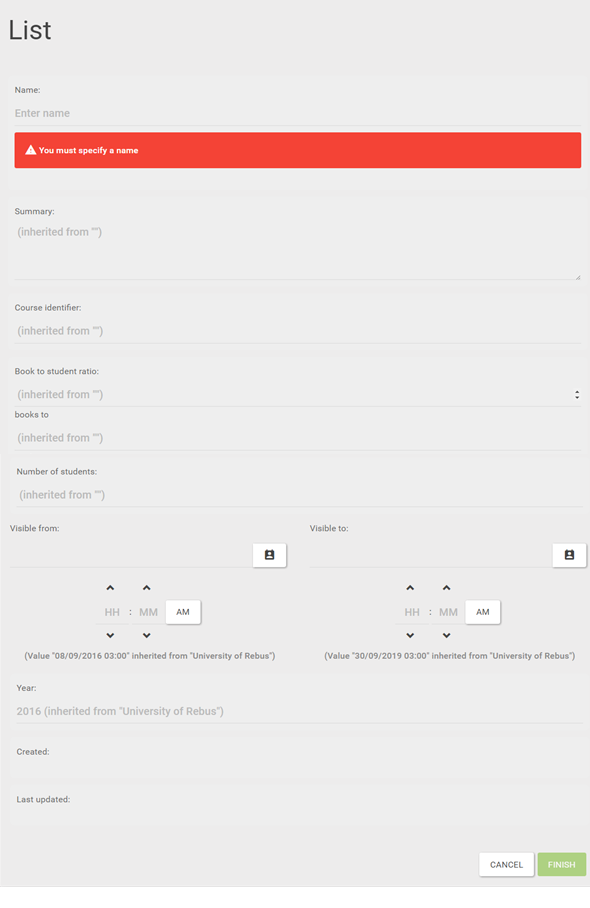

Creating Reading Lists
======================

To create or edit a list you will need to be logged in with the correct
roles and privileges

Logging in and logging out
^^^^^^^^^^^^^^^^^^^^^^^^^^

To Log in click on the Main menu icon at the top of rebus:list,
this opens the menu sidebar.

Click Login

Log in using your username and password.

By default only Administrator and Librarian Users can create new lists
to do this you need to access Manage Hierarchy from here you can create
the Units and Lists that form the structure of rebus:list.

(See Section 9)

List Metadata
^^^^^^^^^^^^^

The metadata for the list is provided during list creation using Manage
hierarchy. Below is the form that is presented to the librarian or
administrative user.

The fields in the metadata form are:

-  Name -This is the list descriptive name as it will appear in the
   headings and hierarchy

-  Summary - This is a brief summary that will display in the header of
   the list

-  Course identifier- This is a course id. It can be either displayed or
   suppressed in Global settings

-  Book to student ratio - This is special entry for reporting. It is
   not a required field

-  Books to - This is special entry for reporting. It is not a required
   field

-  Number of students - The number of students on the course

-  Visible from and to - It’s possible to create lists which are only
   visible between specific dates. This is useful if you are tying lists
   closely to term times

-  Year - This is the year of creation

-  Created - System generated

-  Last updated - System generated

When you have filled out these fields and clicked finish the list is
created. The only mandatory field is Name. Other fields can be left
blank and will inherit data from above (see Section 9.4).

List are suppressed by default so they will not be displayed to the
outside world. It’s important to assign an author or editor role to the
person who will be creating or editing the list. (see Section 11.4).

