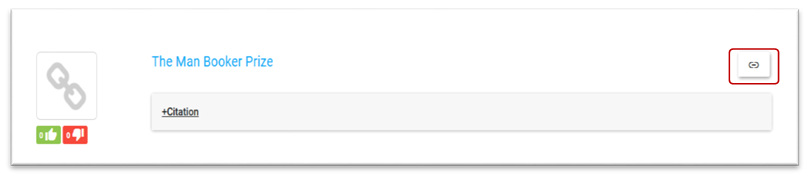

Displaying Items on Reading Lists
=================================

Items on reading lists show different icons on the top right of the list
entry depending on the options available. Book jackets are always
displayed. If no book jacket is found or the material is not a book then
a generic icon representing material type is displayed.

**Table of Contents**

**View Full Text**

Find items on shelf
^^^^^^^^^^^^^^^^^^^

Items which show the Find items on shelf icon will either
display: a link through to the catalogue or discovery platform for
real-time information (e.g. print holdings).

eBooks and full-text
^^^^^^^^^^^^^^^^^^^^

-  Formats with OpenURL and any full-text linking service. Establish the
   base URL for your link resolver in Global Settings (see Section 10)
   for access to full-text by clicking on this icon.

-  The minimum requirement in the reading list record is an ISSN.

-  The more information provided in the record, the more reliable the
   OpenURL record match. Add Volume, issue, pages to the reading list
   record for creating the OpenURL.

-  Click on the icon to retrieve the URL field 856 directly from the
   catalogue and link to an eBook service

Web links
^^^^^^^^^

Link to the URL that has been entered in the rebus:list item record.

View current table of content
^^^^^^^^^^^^^^^^^^^^^^^^^^^^^

-  Links out to a current table of contents service.

-  An ISSN is required in the reading list record.

-  Gives current table of contents for the Journal as a RSS feed.

-  Subscribe to the feed as usual for update alerts in your browser.

Rating material in lists
^^^^^^^^^^^^^^^^^^^^^^^^

-  Users can flag items that they think are useful or not useful

-  Click on the Thumbs up or the Thumbs down image to register interest.

-  A summary will be shown against items that have been rated.

