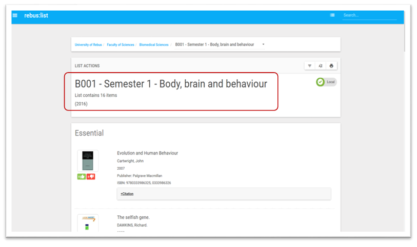
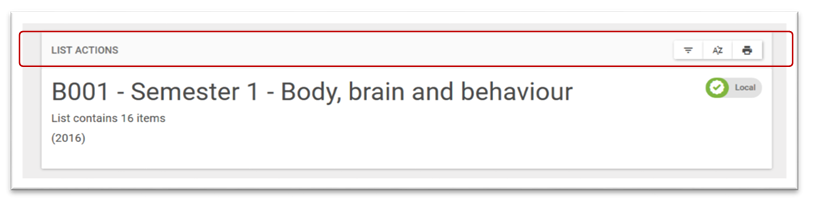
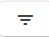
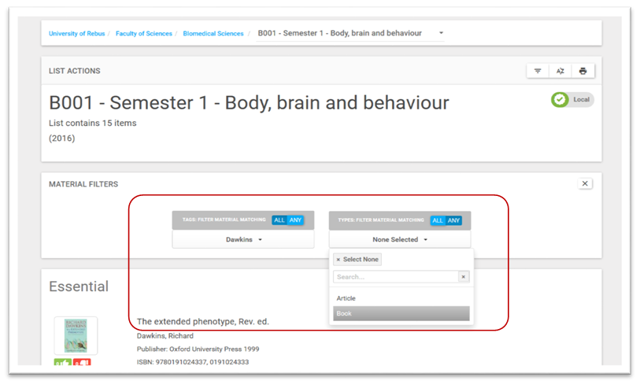
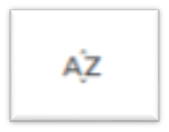
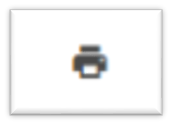

Displaying Lists
================

The List name is displayed on the top left of the lists.

List actions display above list name. It is a sticky toolbar and will
remain visible as you scroll through your list.

In order of display the buttons are:

-  Filter list

-  Sort alphabetically

-  Print list

Filter list
^^^^^^^^^^^

Filter the list by material tag or material type. (see :doc: `manage_tags` )

The filters displayed are dependent on the contents of the list. The
material type filter is always displayed. The tag filter only displays
if tags have been used within the list. The filters can be used
separately or in combination as shown in the example below.

Sort alphabetically
^^^^^^^^^^^^^^^^^^^

Sort alphabetically within each category heading. Clicking again will
reverse the order and clicking ‘Original Sorting’ returns the list to
the order material was originally added in.

Print list
^^^^^^^^^^

Re-formats the list including tags in a format compatible for printing.

