Draft Mode
==========

Click the edit icon to enter ‘Draft Mode’ when you are creating a list
or modifying an existing list. There are several options available to
you in Draft Mode on the List Action toolbar and added to the actions
icons on material entries themselves.

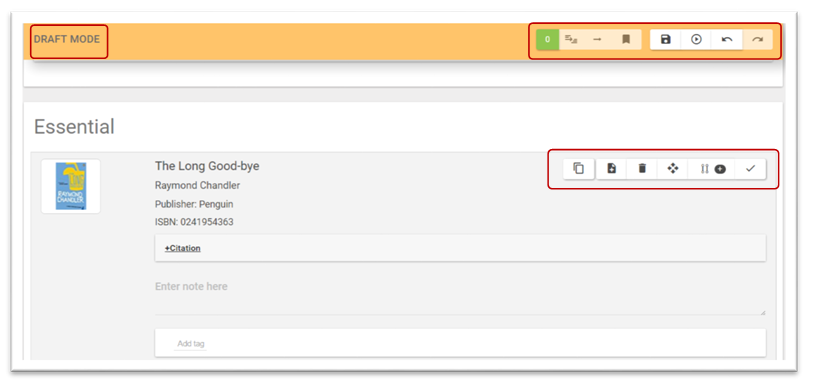

The List Action Toolbar
^^^^^^^^^^^^^^^^^^^^^^^

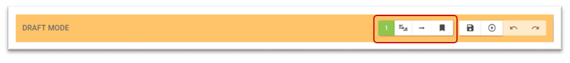

The List Action Toolbar is floating and remains visible as you
scroll down the page. The functions are greyed out if they are not
available. The functions are split into two groups - the first group are
actions that can be carried out on specific selected material, the
second group are related to the whole list.

For the first group of icons to be enabled one or more items on the list
must be ‘selected’ - this is done by clicking the tick icon alongside a
material entry

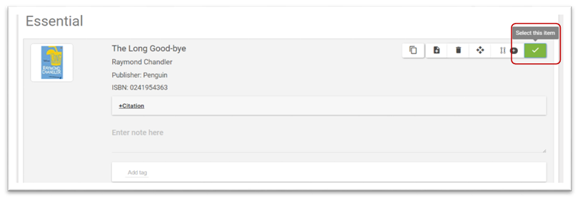

+-----------+------------------------------------------------------------------------------------------------------------------------------------------------------------------------------------------------------------------------------------------------------------+
| .. image:: media/image53.png | Multiple items can be selected allowing you to perform actions on groups of material quickly. This box indicates how many materials have been selected. Clicking the box will select all items in the list.                                                |
+===========+============================================================================================================================================================================================================================================================+
| .. image:: media/image54.png | Create a sublist from the selected materials. Materials can either be moved or copied to a new sublist. On selection the sublist metadata page is opened. (see Section 5.3)                                                                                |
+-----------+------------------------------------------------------------------------------------------------------------------------------------------------------------------------------------------------------------------------------------------------------------+
| .. image:: media/image55.png | Append to an existing list. Materials can either be moved or copied to existing lists. On selection a search box is opened to allow you to choose the relevant list to append to - lists displayed depend on your roles and privileges. (see Section 12)   |
+-----------+------------------------------------------------------------------------------------------------------------------------------------------------------------------------------------------------------------------------------------------------------------+
| .. image:: media/image56.png | Add Tag to material. Using this tool allows for the creation and addition of a tag to multiple items in a list.                                                                                                                                            |
+-----------+------------------------------------------------------------------------------------------------------------------------------------------------------------------------------------------------------------------------------------------------------------+

The other four icons on the toolbar control are specifically related to
the draft. Different icons are displayed depending on the workflow in
use.

Unmoderated Workflow
^^^^^^^^^^^^^^^^^^^^

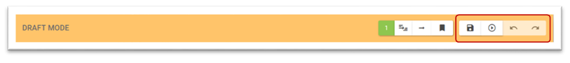

Below is the display for a non-moderated workflow. In a
non-moderated workflow the list owner has full control of list saving
and publication. This is the situation when using the Author list role
(see Section 11.4)

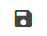

Save draft allows a user to save their work without finalizing
the changes by publishing the list. It also allows collaboration between
users on a draft prior to publication. When a list has a draft saved its
appearance is changed for any user that has editing rights.

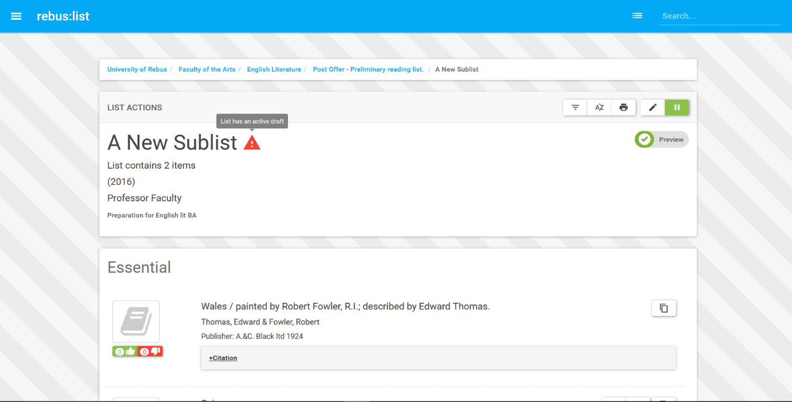

When a user with the required permissions select edit on the saved draft
the edit screen will open and two alert boxes will open with information
about the existing draft. The accept and publish icon also displays
which allows you to publish the draft without making any further
changes.

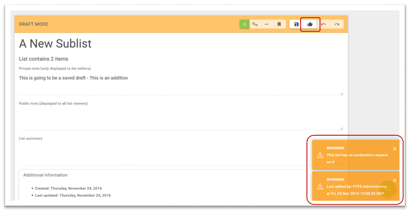

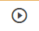

Publishing the list finalizes the changes made in draft mode
it’s the last step in the editing process. When changes are made and
then the list is published any user with viewing rights can see those
changes.

Note. Publishing does not make the list visible to the public, that is
controlled by list suppression.

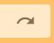

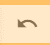

The final two buttons as you would expect undo and redo changes

Moderated Workflow
^^^^^^^^^^^^^^^^^^

The moderated workflow makes use of the Editor and Moderator user roles
(See 11.4) and adds an intermediate step to list creation or
modification. An Editor can build and manage as previously discussed but
can’t publish.

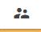

The submit button replaces the publish button in the moderated
workflow. When a user with a role of Editor has finished editing a list
clicking submit flags it as requiring moderation.

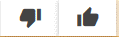

When a user with Moderation permissions edits a submitted list
rather than the standard publish button they are provided with a choice
of ‘Thumbs Up’ accept and publish or ‘Thumbs Down’ reject. If reject is
selected the Moderator will be asked to provide a reason.

In the example below an editor has made a modification to a list and
will then click to submit it for moderation.

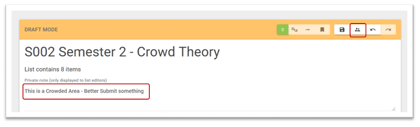

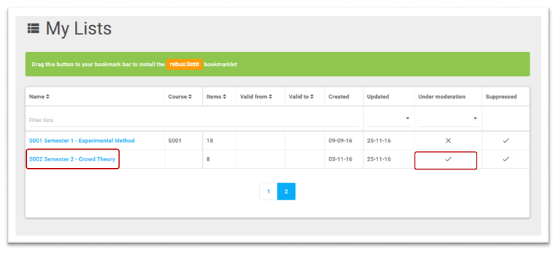

When the Moderator logs in My Lists, they can see that one of
their lists has a moderation request

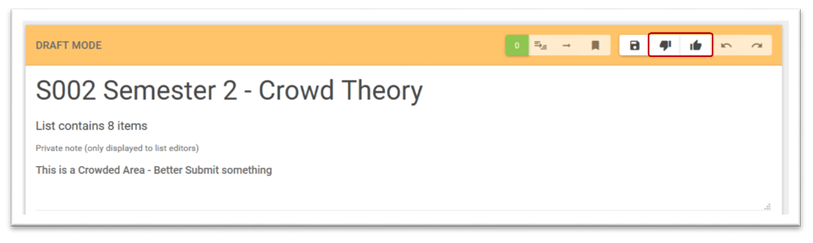

The moderator then opens the list and can either publish the
draft or reject the submission.

Material Manipulation
^^^^^^^^^^^^^^^^^^^^^

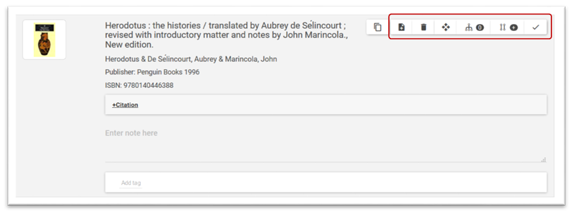

In Draft Mode several edit options are available on the
material in the list itself. Dependant on the material some of these may
not display.

+-----------+-------------------------------------------------------------------------------------------------------------------------------------------------------------+
| .. image:: media/image70.png | Add new item after this one. This allows you to quickly add new material beneath the item you are working from in the list.                                 |
+===========+=============================================================================================================================================================+
| .. image:: media/image71.png | Delete this item. This allows you to delete an item from this list it will not remove the item from the system if it is used in another list.               |
+-----------+-------------------------------------------------------------------------------------------------------------------------------------------------------------+
| .. image:: media/image72.png | Move this item. This allows you to drag and drop an item to different positions in the list.                                                                |
+-----------+-------------------------------------------------------------------------------------------------------------------------------------------------------------+
| .. image:: media/image72.png | Equivalents. This is a connector dependent tool for FRBR-ized records. If enabled it allows for the automatic population of record equivalents. (See 6.5)   |
+-----------+-------------------------------------------------------------------------------------------------------------------------------------------------------------+
| .. image:: media/image73.png | Add list alternatives. This allows you to add alternative records such as different editions.(See 6.6)                                                      |
+-----------+-------------------------------------------------------------------------------------------------------------------------------------------------------------+
| .. image:: media/image74.png   | This allows you to select the material for global editing by the ‘List Action’ tools.                                                                       |
+-----------+-------------------------------------------------------------------------------------------------------------------------------------------------------------+

Equivalents
^^^^^^^^^^^

Some rebus:list connectors search databases that return FRBR records if
a record does have FRBR information rebus:list can use this to
automatically populate record equivalents. Examples of equivalents might
be the hardcopy and electronic version of a journal title. Another
example is when there is a continuation record for a Journal title
occurring because of a title or publisher change.

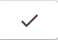

In the example below the title “The histories Herodotus” is
shown as being a FRBR record that is listed as having 17 equivalents.

Clicking the Equivalents button will import the records. Alert boxes
will display to inform you of progress. When the list is published the
Equivalents icon will appear next to the material. Clicking the icon
will drop down the attached records.

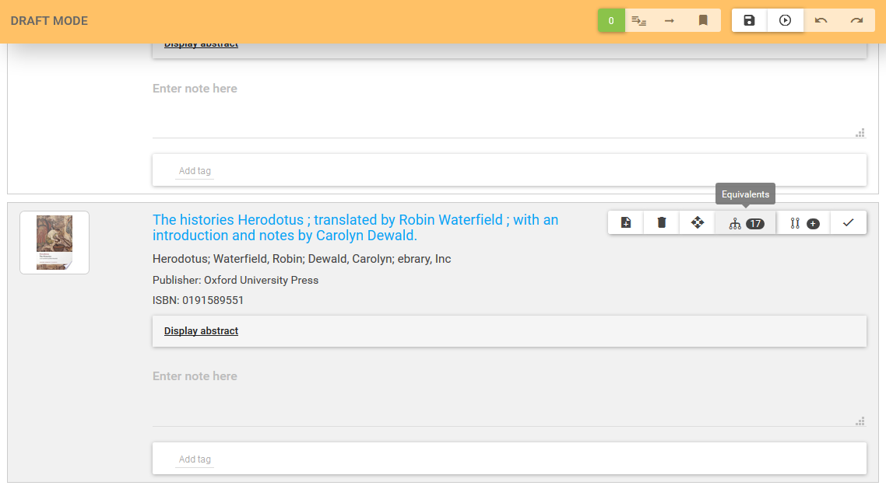

With a title such as this the Equivalents are different
translations of the work.

List Alternatives
^^^^^^^^^^^^^^^^^

The List Alternatives button allows you to add connected records to your
material record. Examples of these could be alternative editions or
versions in a similar way to the equivalent records.

On clicking the Alternatives button you are taken to the standard add
material process (See 5.11)

When you finish creating your new material and publish you will find it
has been added in an alternatives dropdown.

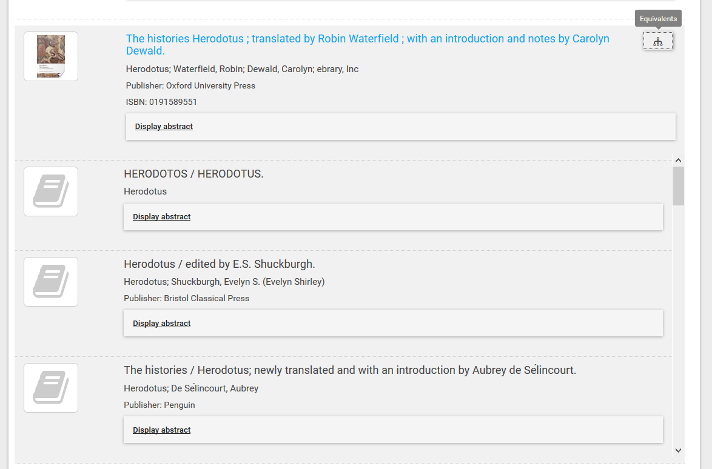

