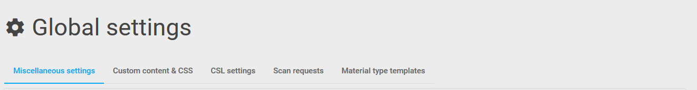

Global Settings
===============

These tabs represent each global setting group:

8.1 Miscellaneous settings:

|image|

Allows you to enable or disable the like feature.

|image|\ Allows you to specify a default administration email address.

Allows you to select one or more of the available book jacket providers

|image|

You can edit, remove or create new Global category headings here. These
headings allow you to organize material, within lists, into meaningful
groups. The changes will automatically take effect on the lists you have
already populated. It’s also possible to add extra categories and to
change the order in which they display using drag and drop. You will be
prevented from deleting a category that already contains material but
you may rename it.

|image|

Enter your resolvers base URL in this box to allow OpenURL linking.

|image|

This is a system setting which defines the out of hours period during
which scheduled reports will run.

|image|

This switch allows you to choose to display the course code along with
the title

|image|

8.2 Custom content & CSS:

The look and feel of rebus:list is highly customisable. You can create
your own front page and footer content, and use CSS to make changes
throughout the system.

Use a web developer tool such as Firebug to identify elements on the
page:

|image|

Logos:

If you have a site logo located on your own website separate to
rebus:list, you can point to the full URL as in Example 3 below.

Please contact PTFS Europe Support if you would like us to host your
site logo on the rebus:list server.

|image|\ Front page content

On migration there are 3 columns of default content starting with:

<h1 class=“front-and-center”>Welcome to rebus:list 2</h1>

:math:`{~}`\ :math:`{~}`\ :math:`{~}`\ 
......

You can change the text here and layout by modifying the html - e.g. to
create 2 columns instead of 3.

You can use the existing CSS or add new CSS declarations that you can
use in conjunction with the Custom CSS block.

|image|\ Custom CSS

Build up any custom changes to existing CSS and add new CSS blocks here.

**Example 1:**

**To change the font colour of the h1 class front-and-center on the
front page**

Modify the Custom CSS block .front-and-center:

.front-and-center {

:math:`{~}`\ :math:`{~}`\ :math:`{~}`\ color: #ff3333;
:math:`{~}`\ :math:`{~}`\ :math:`{~}`/\* NEW \*/

:math:`{~}`\ :math:`{~}`\ :math:`{~}`\ margin: 30px 0;

:math:`{~}`\ :math:`{~}`\ :math:`{~}`\ text-align: center;

}

**Example 2:**

**To hide the rebus:list logo at the top of the navigation page:**

|image|

In Custom CSS add:

/\* Hide rebuslist logo \*/

.navbar-brand {

:math:`{~}`\ display: none; :math:`{~}`

}

**Example 3:**

**To add your logo to the top of the navigation area:**

In Custom CSS add:

#site-logo {

:math:`{~}`\ top: 7px;

:math:`{~}`\ display: block;

:math:`{~}`\ background-image:
url(“http://yourownsite/images/logo.png”);

:math:`{~}`\ background-size: 200px;

:math:`{~}`\ background-repeat: no-repeat;

:math:`{~}`\ height: 66px;

:math:`{~}`\ width: 200px;

}

**Example 4:**

**Once you have added your logo you may need to increase the width of
the navbar:**

In Custom CSS add:

.navbar {

:math:`{~}`\ height: 80px;

}

**Example 5:**

**If the logo is not transparent you may need to change the background
colour of the navbar**:

In Custom CSS add:

.navbar {

:math:`{~}`\ :math:`{~}`\ :math:`{~}`\ :math:`{~}`\ height: 80px;

:math:`{~}`\ :math:`{~}`\ :math:`{~}`\ :math:`{~}`\ background-color:
#ff3333;

}

|image|\ Footer content

This area allows you to enter html to customise the footer area of the
page

|image|\ Site title tag / Customer name

-  Site title tag - appears on the title tabs within browsers

-  Customer name - enter your institution name as you want it to appear
   on labelling and emails it can be used as a tag in the format
   customer\_name anywhere in any of the custom CSS or html on the
   rebus:list system.

8.3 CSL settings:

CSL stands for Citation Style Language and is the language used by the
system to describe the formatting of citations and bibliographies. For
further information:
http://docs.citationstyles.org/en/stable/index.html#

|image|

|image|\ On this system the default style and locale are selected

It is possible to change the citation style if you have the necessary
privileges.

Some of the more common are:

+----+
+----+

-  apa-annotated-bibliography

-  harvard-cite-them-right

-  modern-humanities-research-association

-  modern-humanities-research-association-author-date

-  modern-language-association

-  ieee

-  ieee-with-url

-  oscola

There are many alternative CSL citation styles that can be used they can
be found here:

https://github.com/citation-style-language/styles

Simply select the style you wish to use and copy the filename - omitting
the file extension ‘.csl’

When you enter the name into the CSL citation style box it will be
automatically saved

The CSL locale can also be changed - the available options can be found
here:

https://github.com/citation-style-language/locales

8.4 Scan requests:

These settings allow you to define which materials will have a request
button available and to define an email address to send the request to.

|image|

Use the drop down to select which material types scan request are
allowed for this allow determines when the scan request icon will
display.

|image|

|image|\ 8.5 Material type templates:

The CSL schema defines a large number of material “types”, each type has
its own template. It is therefore possible to have books display in a
different way to journal articles.

Each template is simple HTML with special tags for each material
metadata field (such as title, author, ISBN etc.). A very simple book
template might look like this:

<h1><csl-title></csl-title></h1>

<h2><csl-author></csl-author></h2>

This template would display just the title and author for each material
marked as a book in the list. A full list of material metadata tags can
be found in appendix B.

It is possible to use any HTML elements and attributes in the template.
This, in conjunction with the user defined CSS, offers a lot of control
over list item display.

Special Attributes

In addition to the main material metadata tags, there are a few that can
be added to elements to control their display:

<hide-if-empty>

When this is added to an element, the element will be hidden if any of
its children metadata elements are empty. So, for example:

<h1 hide-if-empty>Title: <csl-title></csl-title></h1>

This would cause the entire <h1\\> element to be hidden if the title of
the item is not populated.

Title: <csl-title></csl-title>

Author: <csl-author></csl-author>

This would cause the entire <h1\\> element to be not display if either
the title or author of the item are not populated

    <rebus-linkify>

When this is added to an element, the element will be converted into an
appropriate link for the item. For example:

<h1><csl-title rebus-linkify></csl-title></h1>

It is possible to tell linkify what type of link you’d like (if
available), the available choices are:

-  “fulltext”

-  “weblink”

-  “findonshelf”

e.g.:

<h1><csl-title rebus-linkify=“fulltext”></csl-title></h1>

If no value is supplied, linkify will try and provide the best link it
can, but this may not be appropriate for the material type.

    <rebus-collapse>

This creates a collapsible section that can be expanded or collapsed, it
useful for initially hiding data that can be expanded by the user. It
accepts a number of attributes:

<rebus-collapse expand-text=“Expand” collapse-text=“Collapse”
element-class=“panel panel-default” heading-class=“panel-heading”
body-class=“panel-body”>

<csl-author></csl-author>

</rebus-collapse>

This causes the item author to be initially hidden within a collapsible
box. The various attributes are:

-  expand-text - The text that is displayed when the box is in its
   collapsed state.

-  collapse-text - The text that is displayed when the box is in its
   expanded state.

-  element-class - One or more CSS classes that should be applied to the
   entire box

-  heading-class - One or more CSS classes that should be applied to the
   box heading

-  body-class - One or more CSS classes that should be applied to the
   box body

       <rebus-citeproc>

This element generates a citation in the CSL format defined in the “CSL
citation style” section of the Global Settings.

<rebus-citeproc></rebus-citeproc>

Generates a citation at the position in the template where the
<rebus-citeproc> element is placed.

|image|
