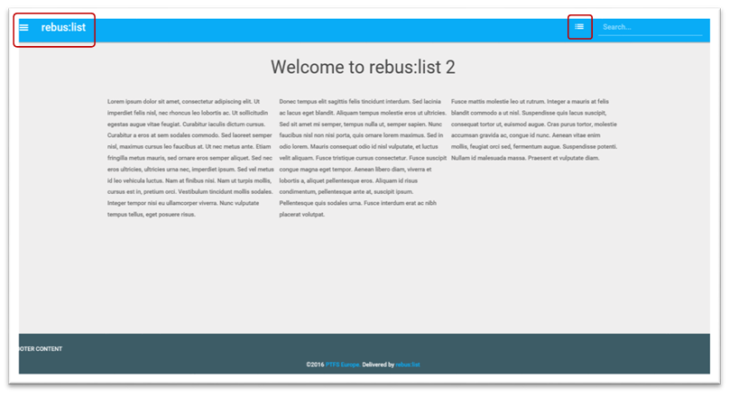
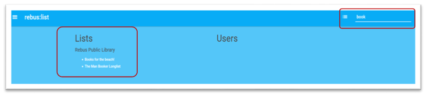
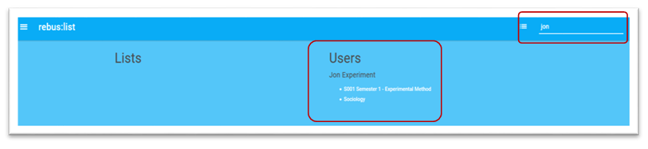
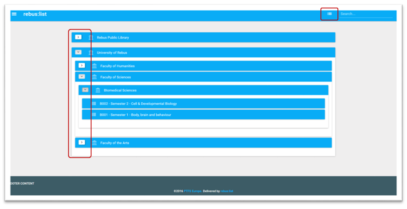
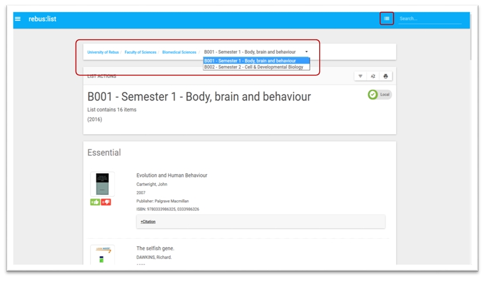

Orientation
===========

rebus:list is a web-based system. From the home page there are links in
the top menu to Search reading lists. Use the menu icon on the top right
hand side to Browse reading lists

The rebus:list logo links to the home page.

Click on the Main menu icon to login to the Administration area - your
permissions will allow you to perform Administration functions as
required.

Search
^^^^^^

To search reading lists and staff members use the Search box on the
right hand side of the menu bar.

As you start typing the window displays matches for both Lists and
Users.

The more text you type the more refined the search results. The search
results pop-up window is split into two halves -

Matches for Lists are displayed on the left hand side.

Matches for Users are displayed on the right hand side.

You can use the search to find a term associated with management
structure - e.g. the School, Course code or the List name. You can also
search for course identifiers or for the staff member or academic
managing the list.

This search box will not return results for materials in lists -
material searches are handled elsewhere

Browse
^^^^^^

Browse allows you to browse through the hierarchy tree structure of
lists to discover a list.

Use the arrows to expand the branches of the hierarchy tree. If
there is no arrow there are no sub-lists.

The arrow indicates that there is a parent level or list above. Click on
the up-arrow to navigate back up through the tree.

Select and click on a reading list to view the items as shown in the
example here.

Clicking on the name of a hierarchy item will either display the
associated list or display the hierarchy from that “unit” downwards.
This is useful for only displaying portions of the hierarchy.

Within a list use the breadcrumb trail to navigate back up the previous
levels in the hierarchy. Use the browse button to jump to the top of the
tree.

