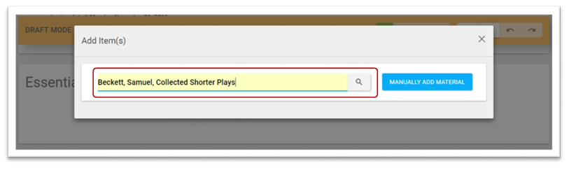
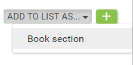

Populating Reading Lists
========================

To start building your reading list you first need to open it - you can
do this by searching or browsing

for the lists. If you are assigned the correct list role for the list it
will appear in ‘My Lists’. You will then need to follow the link to the
list. The example below shows an empty list - to begin populating the
list click the edit button on the List Actions bar.

After clicking edit on a reading list draft mode opens - from this
screen material can be added to any of the “global category headings”
(see Section 8.1). By default these are Essential, Recommended and
Background.

To add new material hover over the green add button and the available
options will expand dependant on your position in the list.

The blue buttons correspond with the different category headings and
display if the correct category is visible. There is an additional blue
button that displays which allows for the creation of sublists which
will be covered in a later section.

Click the relevant blue button and the add material window will open.
There are two separate ways of adding material. It is possible to use
connectors to add material automatically or to add material manually.

Add Material - Via Connector
^^^^^^^^^^^^^^^^^^^^^^^^^^^^

When delivered your rebus:list system will have been configured with
connectors which allow you to search for material across several of your
chosen sources simultaneously.

To do this type your search into the search box and then click the
search icon.

After you carry out the search the results are returned for the
different connectors as well as for material that has been manually
added to existing lists. You then click to expand the results.

You can select one or more of the returned results then click finish to
add them to your list.

In the example below the results from the Copac connector have been
expanded. The required material is the second result down and has been
selected for addition. This is indicated both by the plus changing to a
minus and in the results bar.

Material will take its item type from the connector (if present). In creating a reading list its sometimes necessary to add individual chapters or sections from a single title. To facilitate that rebus:list allows you to add material to the list as a section using a dropdown. 

On clicking finish the material is added to the list.

Note. Local Material is limited to material that has been manually
created.

Add Materials - Manual
^^^^^^^^^^^^^^^^^^^^^^

Material can also be created manually in rebus:list. When you
select to add material manually you will initially need to select a
material type from the drop down. (see Section 8.5)

.. image:: media/image34.png

When you select a Material Type you are presented with the data entry
screen. This screen allows you to add the relevant detail for the
material you are adding. Each material type has number of mandatory
fields, a warning displays if they are not filled out. Mandatory fields
are marked in red.

There are three tabs displayed

Material details is the first tab and it’s here that you can fill out
bibliographic information about the material. Which fields are available
is dependent on material type.\ 

The Second tab provides three fields for specific links
associated with the material

The Third Tab allows you to either create tags or associate existing
ones to the material.

Using the checkbox you can also indicate if the material is in
electronic format or not.

After filling out all the fields and clicking finish you will be
returned to the add items screen.

Click finish on this screen and the material will be added to
the list.

Making Sublists
^^^^^^^^^^^^^^^

When you select to add to a list the button a further option available
is to add a sub-list. This is to allow users who don’t have access to
the hierarchy to create lists related to the list they manage.

After selecting to add a sublist you will be presented with a
simplified version of the List Metadata screen (see Section 4.2)

Once you have filled out the relevant fields and clicked finish your
sublist will have been created. The procedure for populating a sublist
is the same as for a normal list.

When completed sublists can be accessed from the bottom of the parent
list

Sublists are also available from the breadcrumb trail at the
top of the list

To delete a Sublist in Draft Mode navigate to the bottom of the list
where the sublist displays and click on the bin icon next to the list.

rebus:list:it
^^^^^^^^^^^^^

The final way of adding material to a list is via the
rebus:list:it bookmarklet. You can access this on the My Lists page

rebus:list:it is a bookmarklet tool that can be used to import items
from external websites such as catalogues, booksellers, journal
providers, etc.

Drag the image to your bookmarks bar to start using the rebus:list:it
tool. After you have added the tool it will show on your toolbar.

From an external page on a library catalogue opac, a
bookseller, or service (e.g. Amazon, Google Books, a journal provider,
COPAC etc.) from the full view record of an item, click the
rebus:list:it icon on your bookmarks bar to import the item.

When a record is selected, the user will be prompted to choose a list to
add the item to. This will be restricted to lists for which the user has
permission to edit. A connector search is also carried out to check if
the material is available from your other sources.

Making a List Visible
^^^^^^^^^^^^^^^^^^^^^

Once you have finished creating your list to make it visible to the
outside world it will need to be unsuppressed. For users with the
correct permissions to do this is as simple as clicking the suppress /
un-suppress button on the List Actions Bar.

+------------------------------+----------------------------------+
| .. image:: media/image48.png | Un-suppress - Currently Hidden   |
+------------------------------+----------------------------------+
| .. image:: media/image49.png | Suppress - Currently Visible     |
+------------------------------+----------------------------------+

